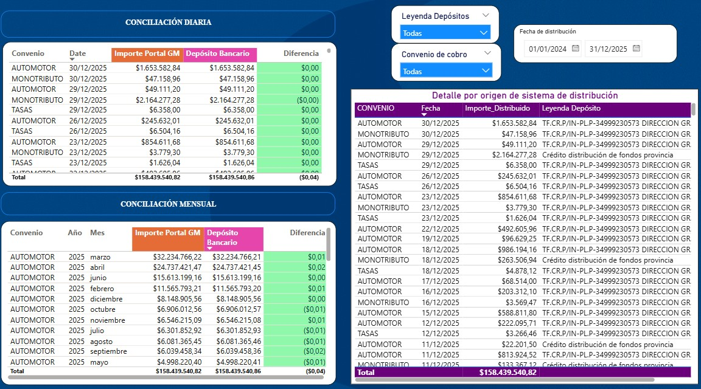
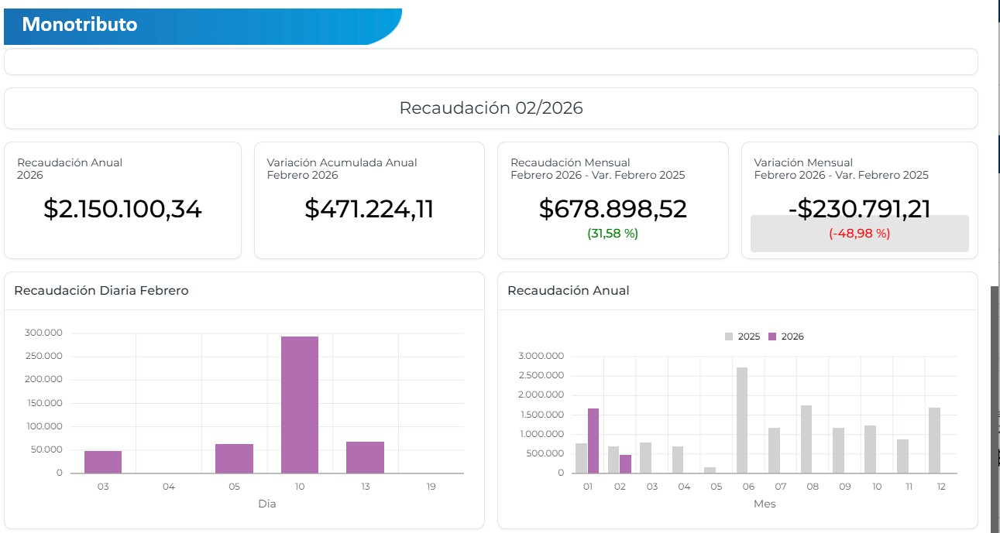

---
title: 📊 Integración y Conciliación de Fondos
excerpt: Automatización y modelado de conciliación financiera diaria para convenios municipales con validación preventiva y consumo externo.
publishDate: 'Feb 24 2026'
featured: true
image:
  src: '/images/conciliacion-cover.jpg'
  alt: Dashboard de conciliación financiera
tags: ['Data Engineering', 'SQL', 'Oracle', 'Power BI', 'Automatización']
---

## Contexto

El proyecto surgió ante la necesidad de profesionalizar y automatizar el proceso de conciliación de fondos correspondientes a cuatro convenios activos, que implicaban la distribución diaria de dinero a aproximadamente 150 municipios.

Operativamente, se enviaban fondos todos los días y era indispensable garantizar que cada transferencia impactara correctamente en el sistema y coincidiera con los movimientos bancarios. El proceso no solo debía ser preciso, sino también transparente para terceros que consumían la información desde un portal de gestión.

---

## El desafío

El principal problema era que los depósitos bancarios no podían diferenciarse de forma directa según el origen de la transacción. La información del sistema interno no se reflejaba con un identificador único en el depósito final del banco, lo que impedía una conciliación uno a uno automática.

Esto generaba:

- Dificultad para detectar diferencias a tiempo  
- Dependencia de validaciones manuales  
- Riesgo operativo ante inconsistencias no detectadas  
- Falta de trazabilidad clara para auditoría  

Además, la base operativa estaba montada sobre un Data Warehouse en Oracle on-premise, lo que implicaba restricciones de acceso y necesidad de integraciones controladas.

---

## Enfoque técnico

Diseñé un proceso de integración y conciliación basado en un modelo relacional dentro del Data Warehouse Oracle. Se construyeron tablas intermedias para consolidar información de origen y aplicar reglas de conciliación por agregación de montos y validación cruzada por fecha y convenio.

La actualización del modelo se programó de forma diaria mediante gateway, permitiendo refrescar la información localmente y sincronizarla con los entornos de visualización.

Se implementaron alertas automáticas por correo electrónico que notificaban:

- Finalización correcta del refresh diario  
- Detección de diferencias en fechas o convenios específicos  

Cuando surgían inconsistencias, el flujo de resolución quedaba formalizado:

- Si el problema estaba en la carga del portal, se enviaba reporte al proveedor externo.  
- Si el error provenía del origen transaccional, se derivaba al equipo de desarrollo para su corrección estructural.  

El proceso pasó de ser reactivo a preventivo.

---

## Visualización y Consumo Externo

Para el control interno, desarrollé un tablero en Power BI que permitía monitorear conciliaciones diarias, analizar diferencias por convenio y detectar rápidamente desvíos.

En paralelo, se desarrolló el informe de recaudación dentro del portal de gestión que consumían terceros, donde podían:

- Consultar información actualizada  
- Descargar el detalle completo de datos  
- Acceder a información consolidada con trazabilidad clara  

La arquitectura final integraba:

Distribución de fondos → Data Warehouse Oracle → Validación y conciliación → Power BI → Portal externo

---

### Dashboard interno de conciliación

---

### Vista del reporte en portal externo

---

## Tecnologías utilizadas

- Oracle Data Warehouse  
- SQL  
- Modelado relacional  
- Gateway de actualización  
- Power BI  
- Automatización y alertas por correo  

---

## Impacto

El proyecto permitió automatizar la conciliación diaria de fondos, mejorar la transparencia hacia municipios y terceros, reducir la dependencia de controles manuales y establecer un circuito formal de detección y escalamiento de diferencias.

Más allá de la automatización, el mayor valor fue estructurar un proceso confiable y auditable, alineando integración de datos, modelado analítico y consumo externo dentro de un mismo ecosistema técnico.
