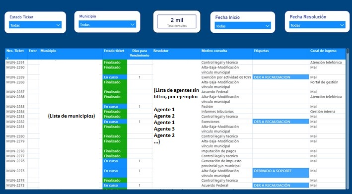
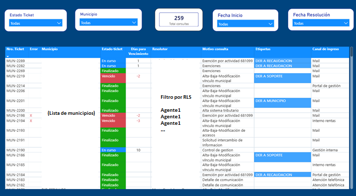

## Contexto

La organización gestiona más de 60 tipos distintos de consultas, incluyendo cuestiones técnicas, normativas y gestiones tributarias. Se trata de una estructura amplia, dividida en múltiples equipos, que trabaja con clientes gubernamentales y opera bajo fuerte presión de cumplimiento de SLA.

El volumen y la diversidad de casos hacían indispensable contar con métricas claras y una visión operativa precisa. Sin embargo, antes del proyecto, la medición del desempeño presentaba importantes limitaciones.

Los agentes no contaban con una visualización clara de su trabajo diario, no podían priorizar correctamente cuando la demanda aumentaba y, en muchos casos, los tickets permanecían abiertos más tiempo del esperado. La evaluación dependía en parte de controles manuales y planillas externas, generando cuellos de botella y pérdida de foco en la resolución efectiva.

---

## El desafío

El problema no era solo visualizar datos, sino estructurar un sistema de medición que contemplara:

- Más de 60 tipologías de casos.
- Derivaciones entre sectores.
- Estados intermedios dentro del flujo de gestión.
- Tiempos reales frente al SLA comprometido.

Además, la organización requería control estricto de acceso a la información. Cada agente debía visualizar únicamente sus propios casos, mientras que supervisores y coordinadores necesitaban una visión consolidada de sus equipos.

Era necesario construir una arquitectura analítica robusta, segura y escalable.

---

## Construcción del modelo analítico

Se diseñó un modelo en esquema estrella dentro de Power BI, estructurando una tabla de hechos principal con el histórico de tickets y dimensiones asociadas a agente, sector, estado, tipología y tiempo.

La definición de identidades fue central en el diseño del modelo, tanto para garantizar coherencia analítica como para permitir la implementación de seguridad dinámica.

Los KPIs no se limitaron a métricas simples. Se desarrollaron cálculos en DAX que contemplaban:

- Tiempo promedio de resolución considerando estados y pausas.
- Casos abiertos vs cerrados en relación al SLA.
- Derivaciones entre sectores y su impacto en tiempos.
- Productividad individual ajustada por complejidad y volumen.

Debido al tamaño del modelo y a la necesidad de aplicar múltiples transformaciones externas a la fuente original, no fue posible trabajar con actualización en tiempo real. En su lugar, se programaron actualizaciones automáticas cada hora, logrando un equilibrio entre frescura de datos y estabilidad del modelo.

---

## Seguridad y control de acceso (RLS dinámico)

Uno de los componentes más relevantes del proyecto fue la implementación de Row Level Security dinámica.

El sistema identifica el correo del usuario logueado y valida su rol dentro de la organización:

- Los agentes visualizan únicamente los casos asignados a ellos como resolutores.
- Los supervisores pueden acceder a la información completa de su equipo.
- Los coordinadores tienen visibilidad global.

Esto permitió eliminar cruces indebidos de información, proteger datos sensibles y garantizar que cada nivel jerárquico tuviera acceso adecuado a su ámbito de responsabilidad.

---

## De dashboard a herramienta operativa

La implementación cambió la dinámica de trabajo.

Los agentes comenzaron a monitorear su propio desempeño en tiempo casi real, identificar casos demorados y reorganizar prioridades cuando la demanda aumentaba. La visibilidad redujo tiempos muertos y permitió destrabar tickets que antes quedaban frenados sin seguimiento claro.

Los supervisores dejaron de depender de planillas externas y comenzaron a realizar seguimiento directo desde el modelo analítico, con métricas objetivas y estandarizadas.

El resultado fue una mejora significativa en los indicadores de rendimiento y una reducción sustancial en los tiempos de gestión, contribuyendo al cumplimiento más consistente del SLA exigido por los clientes gubernamentales.

---

## Arquitectura

Dataverse (CRM Dynamics)  
↓  
Modelo analítico en esquema estrella  
↓  
KPIs y lógica de negocio en DAX  
↓  
RLS dinámico por rol y jerarquía  
↓  
Dashboard operativo en Power BI Pro  

---

### Vista general del dashboard

---

### Vista con seguridad aplicada (RLS)

---

## Tecnologías utilizadas

Power BI Pro  
DAX  
Dataverse (Dynamics 365)  
SQL  
Modelado analítico en esquema estrella  
Row Level Security dinámico  

---

## Impacto

El proyecto eliminó la dependencia de planillas individuales, profesionalizó la evaluación del desempeño y permitió una gestión mucho más ágil frente a reclamos y cuellos de botella.

Los agentes pudieron autogestionar su carga de trabajo, mejorar sus métricas y alinearse con los objetivos definidos. Los líderes, por su parte, pasaron de realizar controles manuales a ejercer seguimiento estratégico basado en información confiable y segura.

Más que un dashboard, se consolidó un sistema de control operativo que fortaleció la eficiencia, el cumplimiento de SLA y la calidad de respuesta ante organismos gubernamentales.
