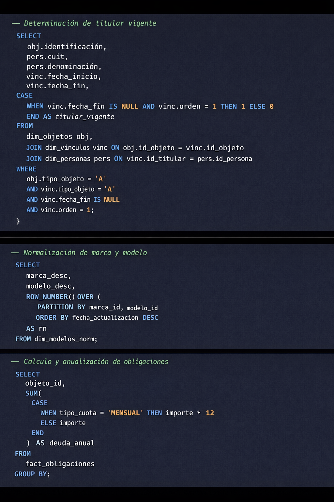

# 🏛 DataMart Tributario en Azure Databricks

## Contexto

Dentro del entorno de Azure Databricks, el modelo analítico provincial concentraba información tributaria proveniente de distintos convenios: Automotor, Monotributo e Inmobiliario, entre otros.

Si bien las tablas base ya existían y estaban normalizadas, su consumo operativo resultaba complejo. Cada análisis requería múltiples joins manuales y reconstrucción de lógica fiscal según el criterio del analista. Esto generaba demoras, inconsistencias y una fuerte dependencia del conocimiento individual.

Era necesario construir una capa intermedia que consolidara criterios y simplificara el acceso, permitiendo generar padrones confiables, responder consultas municipales y realizar cruces entre facturación y pagos de manera estandarizada.

---

## El problema antes del DataMart

Antes de su implementación:

- Los analistas debían cruzar manualmente objetos, titulares, obligaciones y estados.
- La lógica fiscal no estaba encapsulada en una estructura reutilizable.
- Existían diferencias de criterio en la determinación de deuda o estado.
- La respuesta a municipios requería armado manual de consultas.
- Los cruces de facturación y pagos se realizaban con procesos ad hoc.

En el caso del convenio Automotor —uno de los más voluminosos— la granularidad es por dominio (patente), lo que implica clasificar millones de registros correspondientes al parque automotor completo.

---

## Diseño de la solución

Se creó un esquema específico de consumo (`analisismunicipios`) que funciona como DataMart tributario.

El desarrollo fue realizado en notebooks de Azure Databricks, permitiendo documentar claramente la lógica de negocio y estructurar el proceso de forma mantenible.

La solución incluyó:

- Consolidación de padrones por convenio.
- Determinación de titular vigente mediante control de fechas y vínculos.
- Normalización de descripciones técnicas.
- Cálculo y anualización de obligaciones fiscales.
- Identificación de exenciones y condiciones normativas.
- Cruce entre facturación emitida y pagos registrados.
- Unificación de criterios fiscales en todos los convenios.

Cada convenio posee su propia lógica específica, pero todos comparten una estructura estandarizada de consumo.

---

## Caso destacado: Automotor

Dentro del DataMart, el módulo de Automotor representa uno de los mayores desafíos técnicos por volumen y complejidad.

Granularidad: dominio (patente).  
Escala: millones de registros.  

Se resolvió:

- Determinación del titular vigente.
- Clasificación municipal.
- Consolidación de deuda.
- Identificación de vehículos fuera de convenio.
- Generación de padrón para municipios.

Este padrón es utilizado tanto para responder consultas individuales de contribuyentes como para permitir que los municipios liquiden tasas propias.

---

## Arquitectura

Modelo Analítico Provincial  
↓  
Notebook SQL documentado  
↓  
Transformaciones y lógica fiscal consolidada  
↓  
Generación de tablas Delta en esquema `analisismunicipios`  
↓  
Job programado de actualización diaria  

El procesamiento se ejecuta en Azure Databricks sobre millones de registros, optimizando joins y consolidaciones para garantizar consistencia y performance.

---

## Uso operativo

La información generada cumple múltiples funciones:

Internamente:
- Respuesta a consultas individuales.
- Análisis masivo por municipio.
- Validación de deuda y estado tributario.

Externamente:
- Generación de padrones municipales.
- Identificación de contribuyentes fuera de convenio.
- Soporte para liquidación de tasas locales.
- Cruces entre facturación y pagos para control fiscal.

El DataMart se convirtió en la capa confiable desde la cual se responde a organismos municipales y se asegura coherencia normativa.

---

## Impacto

- Reducción significativa en tiempos de respuesta.
- Eliminación de consultas manuales repetitivas.
- Unificación de criterios fiscales.
- Mayor trazabilidad en la determinación de deuda.
- Profesionalización del proceso de generación de padrones.

Más que una consolidación técnica, el DataMart permitió transformar un esquema dependiente del conocimiento individual en una arquitectura analítica formalizada y reutilizable.

---

### Algunas fracciones del notebook

---

## Tecnologías utilizadas

Azure Databricks  
SQL distribuido  
Delta Tables  
Jobs programados  
Modelado analítico multi-convenio  
Optimización sobre grandes volúmenes de datos
